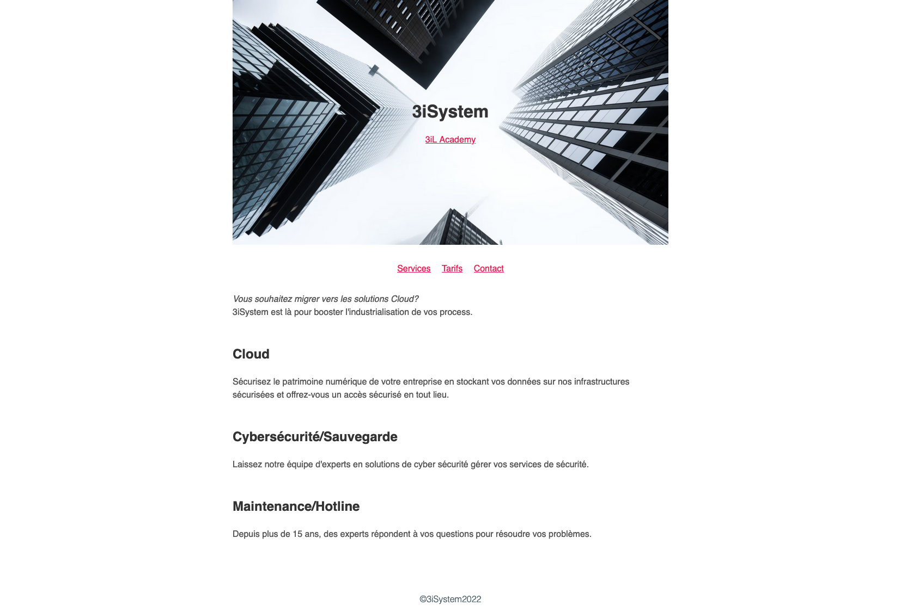

# TP - Créer un site statique pour 3iSystem

## Rendu attendu

L'objectif de ce TP est de produire un site statique similaire au rendu ci-dessous pour la jeune entreprise 3iSystem.




## Mise en place du HTML

* Créer un dossier `tp-html-css`
* Créer un fichier `index.html` à la racine de notre projet et copier le contenu suivant

```html
<!DOCTYPE html>
<html>
    <head>
        <meta charset="utf-8" />
        <title>3iSystem</title>
    </head>
    <body>
    </body>
 </html>
 ```

* Créer un fichier `styles.css` et le <em>lier</em> à `index.html`

* Dans `index.html`, ajouter l'élément header suivant :

```html
    <header> <!-- A ne pas confondre avec <head> -->
        <h1>3iSystem</h1>
        <p>
            <a href="https://www.3il-ingenieurs.fr/" target="_blank">3iL Academy</a>
        </p>
    </header>
```
A la suite nous allons créer une liste contenant 3 liens :
 - vers le pdf `services.pdf` (à copier depuis ce répertoire)
 - vers une page `tarifs.html` (à créer avec une image "Work in progress" ayant comme texte alternatif "Fonctionnalité en construction")
 - vers un lien "mailto"

Enfin, uiliser les balises `<p> <h1> <h2>` pour structurer les textes de la page

## Intégration du CSS

Pour obtenir un rendu semblable à celui proposé, voici quelques une des propriétés utilisées :

```css

/* Pour centrer la page */
body {
    margin: 0 auto;
    max-width: 50em;
}


ul {
    list-style-type: none;
    margin: 2em 0;
    padding: 0;
    text-align: center;
}

li {
    display: inline; /* Pour mettre en ligne notre menu */
    margin: 0 0.5em;
}

/* La mise en forme du header est géré avec les propriétés background */
header {
    background-color: #263d36;
    background-image: url("https://images.unsplash.com/photo-1601041084273-6114cad589d5?ixlib=rb-1.2.1&ixid=MnwxMjA3fDB8MHxwaG90by1wYWdlfHx8fGVufDB8fHx8&auto=format&fit=crop&w=2070&q=80");
    background-position: center top;
    background-repeat: no-repeat;
    background-size: cover;
    line-height: 1.2;
    padding: 10vw 2em;
    text-align: center;
}
```

* La police utilisée est l'Helvetica
* La couleur des liens est #e81c4f;
